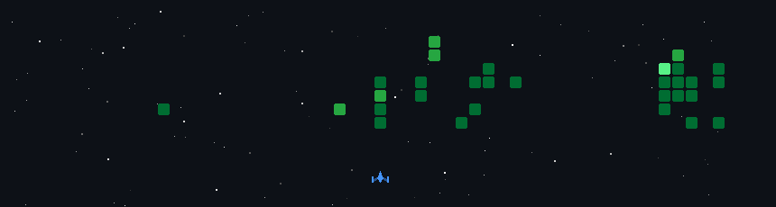

<div align="center">

# `> whoami`

# ViprorqiV

### Cybersecurity Student

<pre>
┌─[nam@security-lab]─[~]
└──╼ $ Building • Breaking • Understanding • Securing
</pre>

</div>

---

## `> about`

Cybersecurity student interested in **network security, systems programming, DFIR and security automation**.

```text
PRIMARY     Network Security · Go · Security Engineering
ACTIVE      Honeypots · Web Security · DFIR
EXPLORING   Rust · Cloud Security · Security Automation
```

---

## `> arsenal`

### Languages

<p align="center">
  
  
  
  
</p>

### Frameworks & Systems

<p align="center">
  
  
  
  
  
  
  
</p>

---

## `> coding_activity`

<div align="center">

<a href="https://leetcode.com/u/ViprorqiV/">
  
</a>

</div>

---

## `> projects`

### 🐝 [BeeLearn — AI-Powered LMS](https://github.com/0viprorqiv0/eng_project)

`React 19` · `TypeScript` · `Laravel 12` · `MySQL` · `Gemini API`

Full-stack learning management system with **role-based dashboards, interactive learning features, placement testing and AI assistant integration**.

### 🖥️ [Windows System Monitor](https://github.com/0viprorqiv0/System_monitor)

`C++` · `Win32 API` · `PDH` · `IP Helper` · `GDI`

Native Windows monitoring application for **real-time CPU, RAM, network and process analytics** with a taskbar overlay and floating desktop widget.

### 🔐 [SecureVote — Cryptographic E-Voting](https://github.com/MRXz194/E-voting)

`Python` · `Flask` · `SQLite` · `ElGamal` · `RSA Blind Signatures` · `HMAC-SHA256`

Team cryptography project demonstrating **anonymous credentials, encrypted ballots, homomorphic tallying and verifiable voting**.

---

## `> current_mission`

```yaml
focus:
  - Build practical security tools
  - Understand networks and systems
  - Improve Go and Rust
  - Learn by building real projects
```

---

## `> github_stats`

<div align="center">


</div>

---

## `> contribution_shooter`

<div align="center">



</div>

---

<div align="center">

```text
Learn → Build → Break → Understand → Secure
```

### `There is always another layer.`

</div>
